<!-- Твой Марио -->
<picture>
  <source media="(prefers-color-scheme: dark)" srcset="mario-final.svg">
  <source media="(prefers-color-scheme: light)" srcset="mario-final.svg">
  
</picture>

 

<!-- Твоя статистика с защитой от кеша -->

